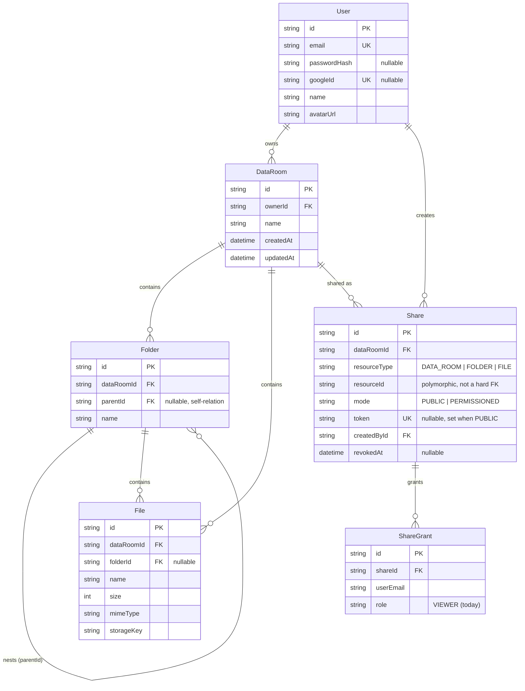

# Data Room

A virtual data room for due-diligence document sharing — folders, files, and granular sharing (public link or per-person), built as a full-stack monorepo.

- **Frontend**: React + Vite + TypeScript + Tailwind + hand-built shadcn-style components (Radix primitives) — `apps/web`
- **Backend**: Node + Fastify + TypeScript + Prisma — `apps/api`
- **Database**: PostgreSQL (Supabase)
- **File storage**: Supabase Storage (S3-compatible, signed URLs)
- **Auth**: email/password (bcrypt + JWT) and Google Sign-In (ID-token verification)
- **Shared types**: `packages/shared` — DTOs used by both apps so the API contract can't silently drift

**Hosted URLs**: _frontend: TBD (Vercel) · backend: TBD (Render)_

---

## Setup

### Prerequisites

- Node 20+
- A Postgres database (Supabase recommended — gives you Storage in the same project)
- A Supabase Storage bucket (private) for file blobs
- (Optional) a Google OAuth Client ID, for Google Sign-In

### 1. Install

```bash
npm install
```

This installs all three workspaces (`apps/web`, `apps/api`, `packages/shared`) via npm workspaces.

### 2. Configure environment

```bash
cp apps/api/.env.example apps/api/.env
cp apps/web/.env.example apps/web/.env
```

Fill in `apps/api/.env`:

| Var | Notes |
|---|---|
| `DATABASE_URL` | Postgres connection string. On Supabase, use the **Session pooler** string (`...pooler.supabase.com:6543`), not the direct `db.<ref>.supabase.co` host — the direct host is IPv6-only and unreachable from many networks/CI runners. |
| `JWT_SECRET` | Any long random string |
| `SUPABASE_URL` / `SUPABASE_SERVICE_ROLE_KEY` | From Project Settings → API. The **secret/service-role** key is required (not the publishable/anon key) — uploads go through the backend with elevated storage permissions, bypassing bucket RLS. |
| `SUPABASE_BUCKET` | A private bucket you create once in Supabase Storage |
| `GOOGLE_CLIENT_ID` | Leave blank to disable Google Sign-In (the button just won't render) |
| `CORS_ORIGIN` | Your frontend origin(s), comma-separated |

Fill in `apps/web/.env`:

| Var | Notes |
|---|---|
| `VITE_API_URL` | Backend base URL |
| `VITE_GOOGLE_CLIENT_ID` | Same Google Client ID as the backend, or blank |

### 3. Database

```bash
cd apps/api
npx prisma migrate deploy   # applies the committed migration
npx prisma generate
```

### 4. Run

```bash
npm run dev:api   # http://localhost:4000
npm run dev:web   # http://localhost:5173
```

### 5. Build (both apps + shared types)

```bash
npm run build
```

---

## Design decisions

**Bearer JWT over cookies.** The frontend and backend deploy to different domains (Vercel / Render), so an `httpOnly` cookie would need `SameSite=None` cross-site cookies, which is fragile in practice. A `Bearer` token in `Authorization`, stored client-side and attached by an axios interceptor, sidesteps that entirely. Trade-off: more exposed to XSS than an `httpOnly` cookie — acceptable for this scope, would revisit for a real production auth system.

**Name conflicts: silent-resolve on upload, block-and-suggest on rename/move.** Uploading 20 files shouldn't stop and ask you 20 times — duplicate names during upload are auto-resolved to `"name (1).pdf"`, Drive-style. Renaming or moving a single file is a deliberate, single-item action, so there the API returns `409` with a suggested next-available name and the UI offers to use it — see `apps/api/src/lib/naming.ts` and `lib/conflicts.ts`. Comparison is case-insensitive at the app layer (the DB unique constraint is case-sensitive and only serves as a last-resort race-condition backstop, since Postgres also treats a `NULL` `parentId`/`folderId` as distinct from every other `NULL` — i.e. it can't fully enforce this constraint on its own for root-level items).

**Authorization is one ancestor-walk, used twice.** `lib/authz.ts` walks a folder's `parentId` chain to the root. That walk builds breadcrumbs, and it also builds the list of ancestor resource IDs checked against `Share` rows — so sharing a folder automatically covers everything nested inside it, with no separate "inherited permission" bookkeeping to keep in sync.

**Two Share rows, not one.** A resource can have an active `PUBLIC` share (a token) and an active `PERMISSIONED` share (a list of `ShareGrant` emails) simultaneously, as two rows rather than one row with mixed-mode fields. Revoking one doesn't touch the other, and the shape stays simple to extend (see "per-user roles" below).

**Delete = DB cascade + explicit blob cleanup.** `onDelete: Cascade` handles the relational cleanup (deleting a folder cascades its nested folders/files/shares in one statement). Supabase Storage isn't part of that transaction, so before the cascade fires, the app walks the subtree, collects `storageKey`s, and best-effort deletes those blobs — an orphaned blob is preferable to a delete that fails outright because a storage call flaked.

**Dev database note.** This project was built inside a network-restricted agent sandbox that could not open a raw Postgres connection (only HTTPS egress worked) — so the schema was iterated locally against SQLite first, then finalized against Postgres, with the initial migration generated offline via `prisma migrate diff --from-empty` (no live DB needed) and committed. It applies cleanly with `prisma migrate deploy` on any host with normal network access (your machine, Render's build step, CI).

---

## Data model / ERD



`Share.resourceId` is deliberately polymorphic (a plain string, not a foreign key) so one table can share a `DataRoom`, `Folder`, or `File` without three near-identical join tables. The app layer resolves and validates it against `resourceType` on every write (`assertResourceBelongsToRoom`).

### How it scales

**Computing a folder's total size and item count, including its whole subtree.**
`lib/stats.ts` uses a Postgres recursive CTE (`WITH RECURSIVE`) that walks `Folder.parentId` down from the target folder, then aggregates `File.size`/count over every folder in that set. It's computed on demand (used for the delete-confirmation preview), which is correct and simple at MVP scale — a room with a few thousand items resolves in one query, no app-side loops. It does not scale indefinitely: every call re-walks the subtree. At real scale, the fix is to stop computing it on read and start maintaining it on write — either denormalized counters (`itemCount`, `totalSize`) on `Folder`, incremented/decremented in the same transaction as each file/folder create/move/delete (a materialized-view-style optimization, trading write cost for O(1) reads), or a closure table (`ancestor_id, descendant_id, depth`) that turns "everything under folder X" into an indexed lookup instead of a recursive walk. Either removes the recompute-the-whole-subtree cost from the hot path.

**One data room with 100,000 files.**
Three things break in order as a room grows: unbounded listing, `OFFSET`-based pagination, and substring search.
- *Listing*: `folders`/`files` queries are already scoped by `(dataRoomId, folderId)`, which is indexed (`@@index([dataRoomId, folderId])` on both tables) — but the current API returns a full folder's contents in one response. At 100k files *in a single folder*, that needs real pagination: a keyset/cursor cursor on `(name, id)` (or `(createdAt, id)`) rather than `OFFSET`, which degrades linearly as the offset grows.
- *Indexes*: the existing `(dataRoomId, folderId)` index needs to become `(dataRoomId, folderId, name)` to keep the paginated, sorted listing an index-only scan instead of an index-scan-then-sort.
- *Search*: `name.contains` (an `ILIKE '%q%'` under the hood) can't use a b-tree index at all — it's a sequential scan. At this scale that needs `pg_trgm` (trigram GIN index) for substring search, or a move to real full-text search if search needs to expand beyond filenames.
- *Frontend*: the file browser currently renders the full response in one list; at 100k it'd need windowing/virtualization and an infinite-scroll fetch tied to the same cursor.

**Extending sharing to per-user roles (viewer/editor) without remodeling.**
`ShareGrant.role` already exists as a column (`ShareRole` enum, currently only `VIEWER`) specifically so this doesn't require a schema change later — only adding `EDITOR` to the enum. The single access-check path (`assertViewAccess` in `lib/authz.ts`) would gain a sibling, `assertEditAccess`, that resolves the same ancestor-chain-matched grant and checks `role === "EDITOR"` (or ownership) instead of just "a grant exists." Route handlers that currently gate mutations behind `assertOwnerAccess` (folder rename, file move, etc.) would swap to `assertEditAccess` where non-owner editors should be allowed to act. The owner concept stays separate and un-revocable — an editor grant is still a grant, not co-ownership.

---

## Where AI was used

This project was built with Claude Code as a pair-programmer for essentially the whole build: architecture/schema design, all backend route and authorization logic, all frontend components (including hand-rolling a shadcn-style component set on Radix primitives, since the `shadcn` CLI needs an interactive prompt this environment doesn't have), and this README. Notable moments where the AI did real diagnostic work rather than just generation: tracing a Prisma `P1001` connection failure down to "this sandbox can only reach the internet over HTTPS" via `nc`/`dig` probing against multiple hosts and ports, then working around it by generating the initial migration offline (`prisma migrate diff --from-empty`) instead of blocking on live DB access. Product/scope decisions (which auth methods, which storage provider, deploy targets, the sqlite-then-postgres dev sequencing) were made interactively with the project owner throughout rather than assumed upfront.
